# Rasterizer
{:.no_toc}

## Table of contents
{: .no_toc .text-delta }

1. TOC
{:toc}

---
## Overview

This homework focuses on different sampling techniques that we learned in our graphics class. Our goal here is to create functions that can take svg files and use different sampling methods
and filters to adjust the way images are projected on the screen. Details on how we implemented each function will be explained below.

## Drawing Single-Color Triangles
To rasterize triangles, we want to sample one point at the center of each pixel and color it based on the given inputs to make our drawings.

For this task, we implemented the `rasterize_triangle()` function in `rasterizer.cpp` using a basic sampling method by taking the middle point of each pixel. At first, we
decided to loop through the entire width and height of the canvas to check if it's in bounds. We originally wanted to make our own function to check if a certain x y coordinate
was in a triangle, but we realized that we could call the `inside()` function that takes care of it for us. This seemed like a simple task. All we had to do was loop through the entire canvas,
sample the svg file at row i + 0.5, column j + 0.5, and fill that pixel with the sampled color.

However, we ran into some problems. The first problem was that there were some white lines generated during our first run. After some debugging, we realized that this was because of
how we made the for loop end at width - 1 and height - 1 when we didn't need to subtract one from both dimensions. It was an error in our thinking because we assumed the +0.5 would
go out of bounds, but the for loop already accounts for it if we use less than instead of less than or equals to. Additionally, we also had some images where only half sof each shape was rendered
correctly. This was because we forgot to account for the right hand rule, and all we had to do was add in another inside check in our if statement. Finally, we fixed the speed by making sure we loop in the right place.
We were originally looping through the entire screen, but we noticed that it's faster to loop around the bounding box of the triangle. We do this by taking the min of all x points, min of all y points,
max of all x points, and max of all y points to get our corresponding box dimensions. This sped up the process and made our images generate much faster than before.

 

*The Original Failure (No Right Hand Rule):*

*After Adding in the Right Hand Rule:*

*The Cube's Edges Using Basic Sampling:*
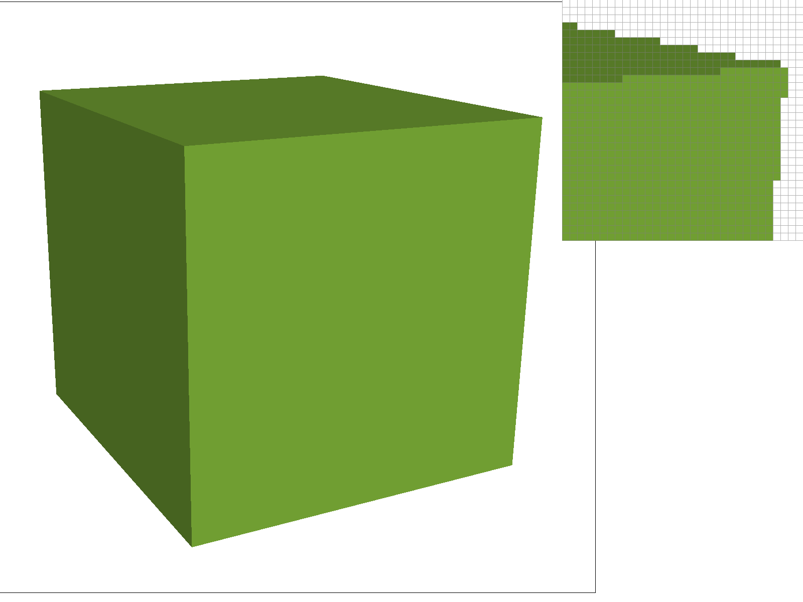

*The test4.svg File Working:*
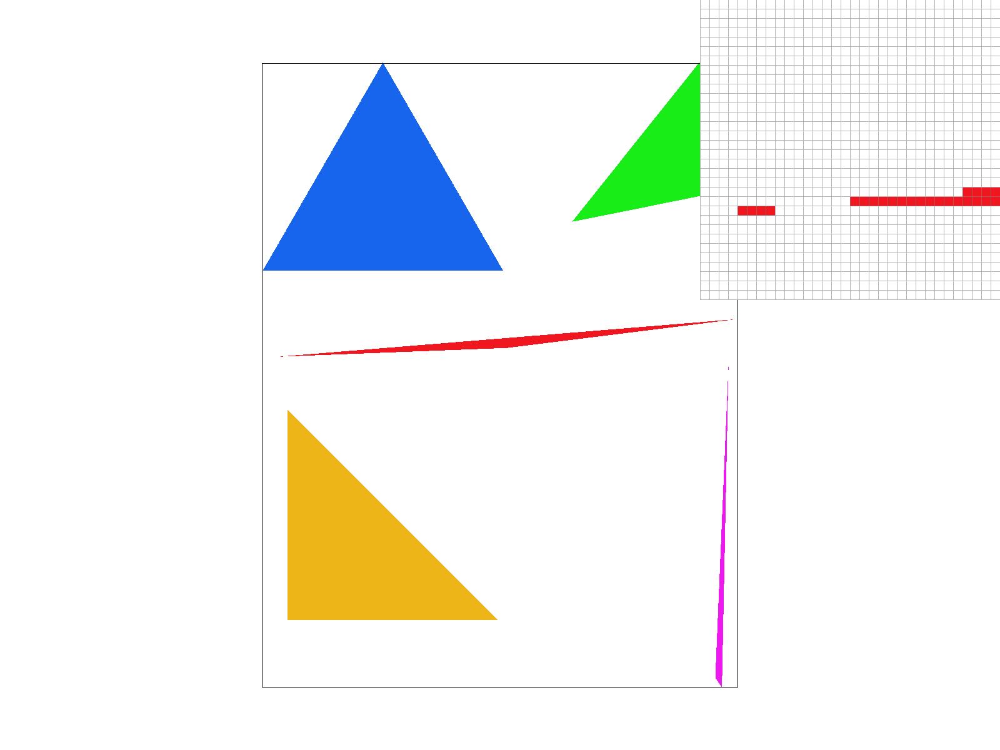

## Antialiasing by Supersampling

To supersample, we have to take more points inside each pixel and average them out. The basic sampling rate from Task 1 could be likened to a supersample rate of 1, but now we want to increase it based on
what the user wants. For example, if the supersample rate was 4, that means that we "divide" the pixel into 4, take the center of each of those divisions, and then average out the 4 colors. This
averaged color will be used to fill the entire pixel, giving it an antialiasing effect. Supersampling is important and useful because it can make jagged corners look more smooth and refined while also reducing
artifacts in our image.

For this task, we had to modify `rasterize_triangle()` and `fill_pixel()`. However, before changing those functions in order to calculate the colors, we needed to be able to store the points correctly.
First, we had to change the size of the sample_buffer depending on what supersampling rate we were using. We modified `set_framebuffer_target()` to correctly calculate the new size and adjust whenever needed.
Instead of just using `width * height`, we now want to use `width * height * sample_rate`. This indexing format meant that if the supersample rate was 4, each pixel would take up 4 indices. For example, pixel #1
would originally take the color at index 0. However, now pixel #1 would take the colors at index 0, 1, 2, and 3. The next pixel (#2) would take the colors 4, 5, 6, and 7.

After figuring out how to store the colors, we also needed a way to know which coordinates to sample and how we can access them later. We used the line `step_size = 1.0f / sqrt(get_sample_rate())` to calculate
our step size correctly, and we also figured out where to stop by using the line `max_sample_rate = sqrt(get_sample_rate())`. Our nested loops now contained 4 for loops, and we also modified `resolve_to_framebuffer`
to correctly retrieve the colors. To average the colors, we sum all colors up then divide each R, G, and B component by the sampling rate. For `fill_pixel()`, we also modified the parameters to take in a boolean called
`isPoint`. If `isPoint` is true, then we fill all indices related to that pixel based on the supersample rate to be that exact color. It will not be averaged with the surrounding colors if it's a point.

We ran into a few problems calculating the correct index, causing some weird behaviors like dotted patterns. Additionally, we would crash consistently because we did not resize our canvas properly. After some debugging, we were able to correctly sample the
colors and store in the `frame_buffer` while adjusting it when needed. This led to a working antialiasing effect for all our svg files.

 

*Our Notes:*
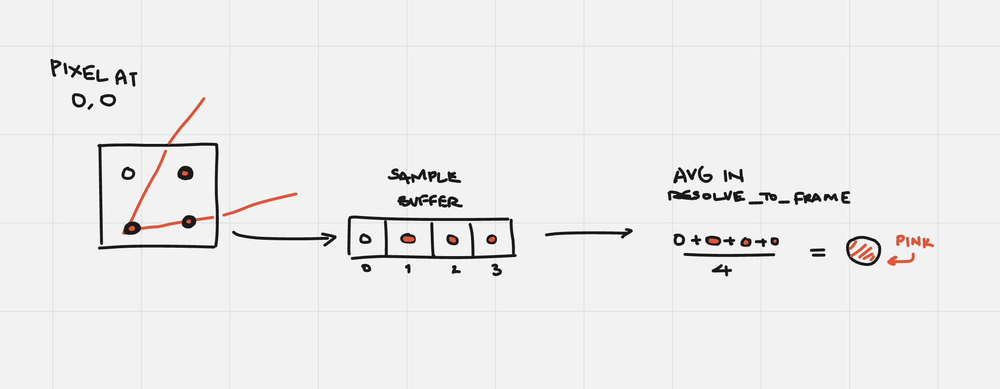

*Clearer Flower, Dots Are Not Directly Supersampled*
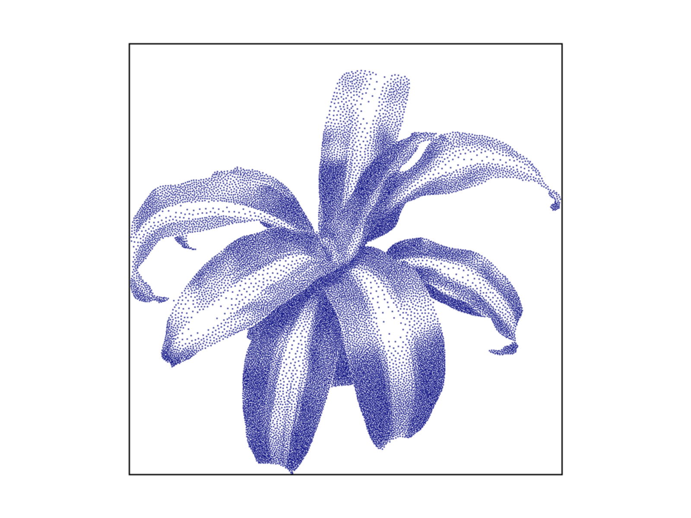

*Antialiasing Effects on the Cube*
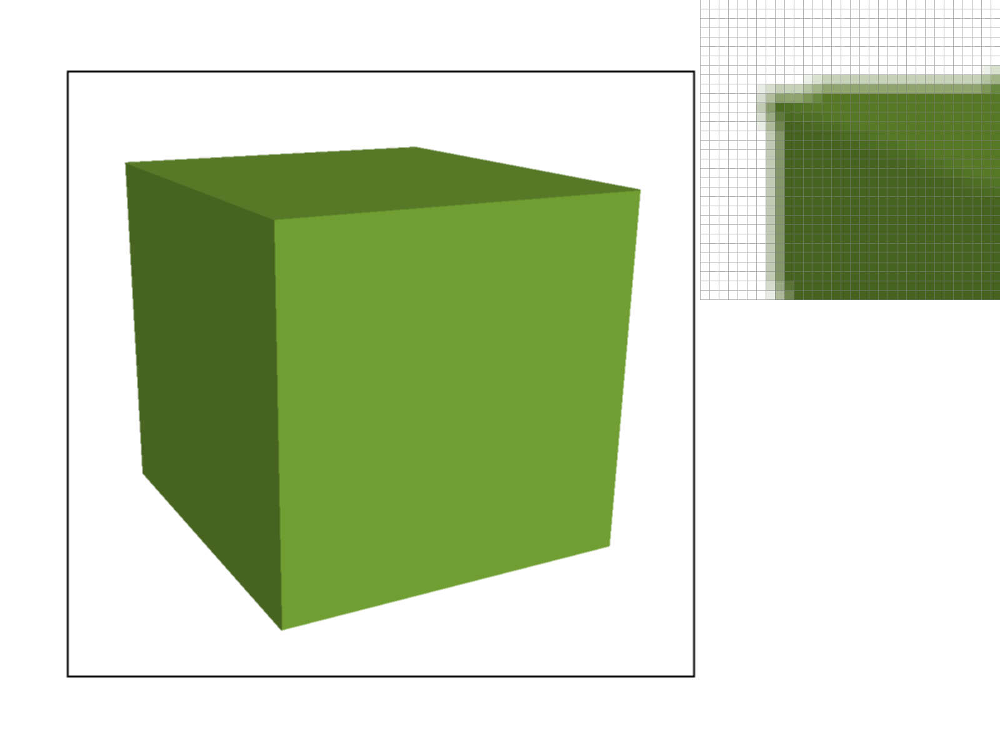

*Supersampling at Rates 1, 4, 9, and 16:*
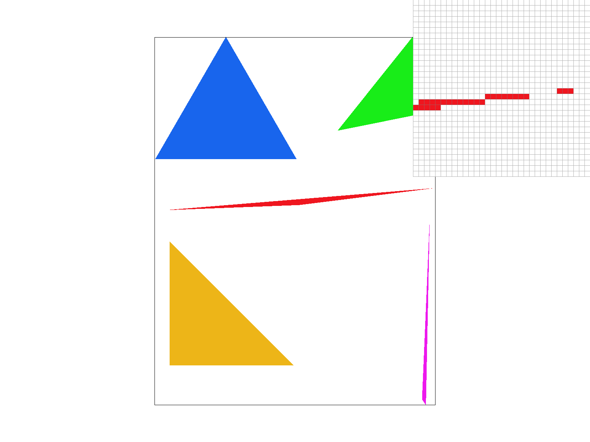
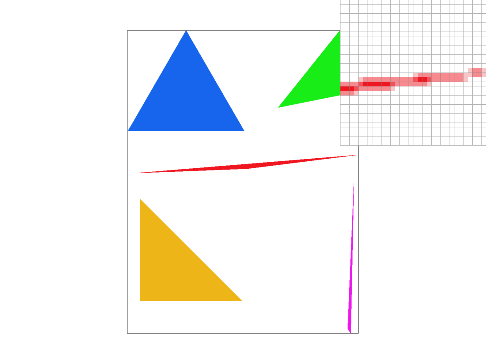
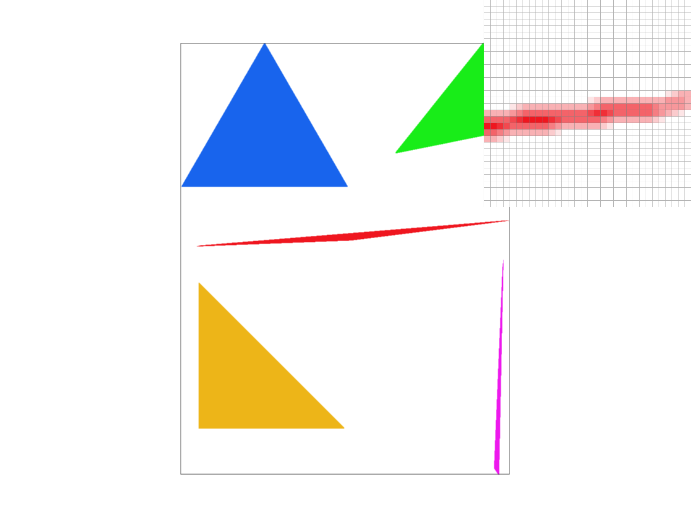
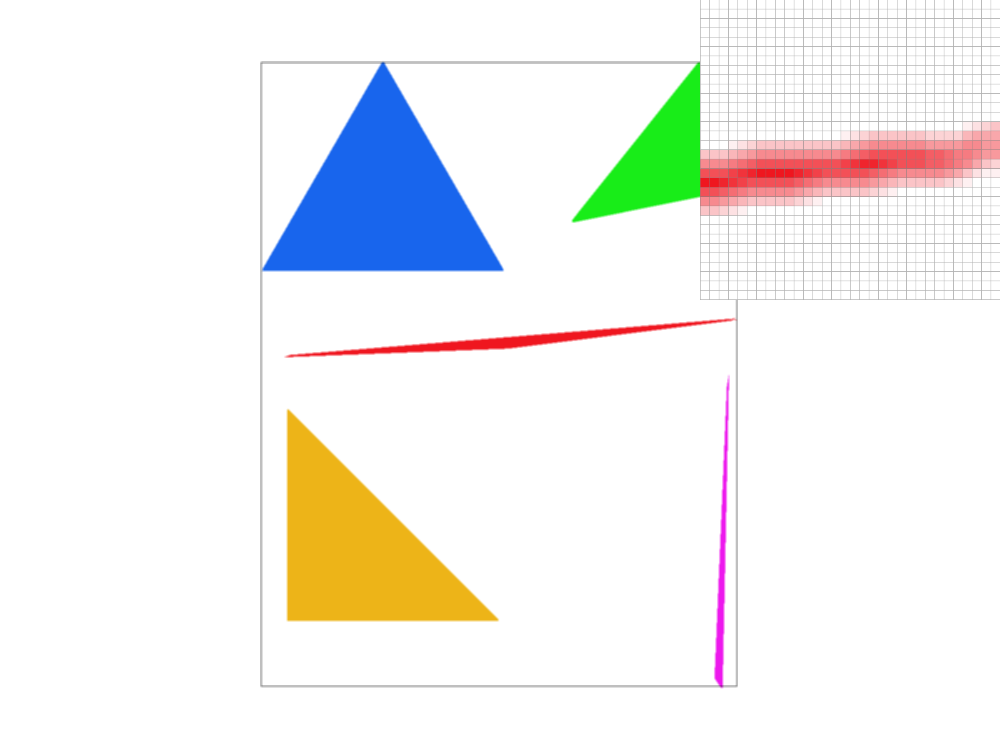

## Transforms

For Task 3, we had to modify the `transforms.cpp` file and change `translate()`, `scale()`, and `rotate()`. These three functions
were relatively simple to change. For translation, we start with a matrix filled with all 0's except for 1's filled diagonally from top left
to bottom right. Afterwards, we put dx and dy in the right column to make translations work correctly. Next, we modified scale to be similar.
We also want to start with a matrix filled with 0's, but going diagonally from top left to bottom right, we would put dx, dy, and then finally a 1.
Lastly, for rotations, we had to put in a matrix filled with 0's. However, for the top left 4 elements of the matrix, we would put
cos(deg), -sin(deg), sin(deg), and cos(deg). Finally, we put a 1 in the bottom right corner of the matrix.

We originally ran into a bug where the sin and cos functions imported from the Math library would take in parameters as radians. To fix this,
we multiplied our input `deg` by `M_PI` (3.1415) and divided it by 180. Afterwards, our robot was aligned correctly.

Our modified robot is rotated and transformed to look like it is jumping. We also modified the colors so that the robot looks more human and has
a blue shirt and navy blue jeans.

*The Default Red Robot:*

*Our Modified Robot:*
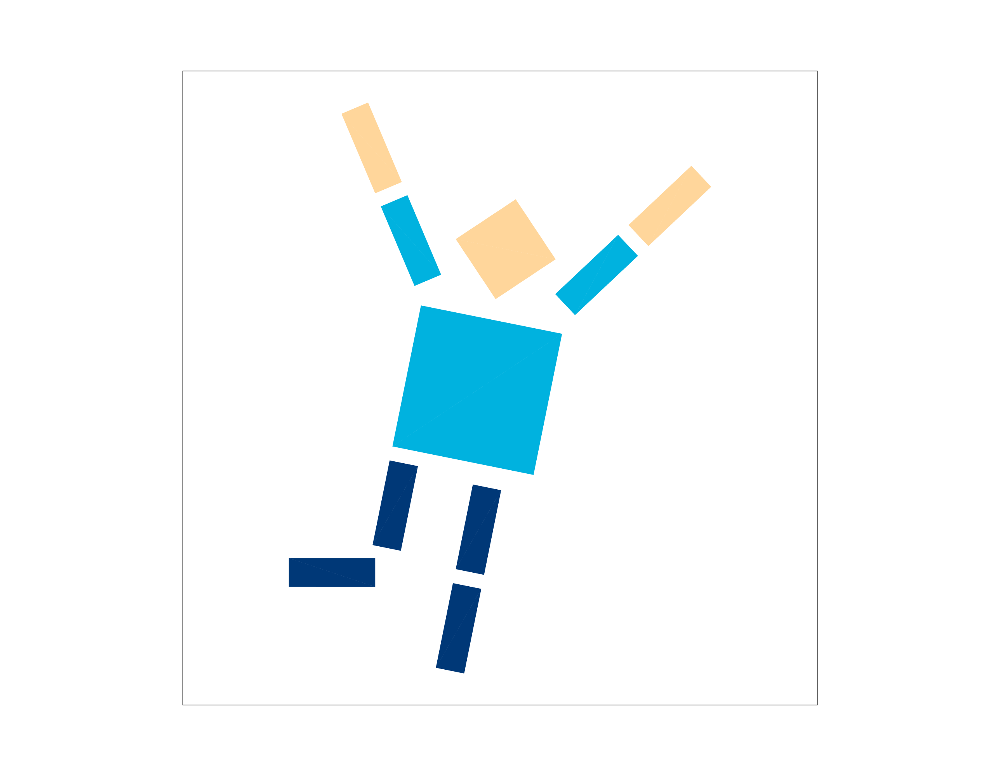

## Barycentric Coordinates

Barycentric coordinates are useful when we need to interpolate values across a triangle. Here, barycentric coordinates tell us how much each vertex in the triangle contributes to the color of a point.

My approach to this task began with reviewing the slides to understand how barycentric coordinates function visually. I learned that it involves using three vertices to calculate the alpha, beta, and gamma values, which are then used to blend colors at the central vertex. Next, I identified the smallest and largest x and y values to traverse each point, checking if it lies inside the triangle using the inside function. If a point is inside the triangle, I applied the equations to find the values of a, b, and g. These values were then multiplied by c0, c1, and c2, respectively, to obtain the mixed color.

Here is a picture of 3 colors. At the vertex, we can see that in the middle, each point influences the color so that it gives a mix of those 3 colors.

Originally, the each color was not influence each other so that it would have a high frequency between each color. After applying barycentric, we can obeserve that there is a smooth color transition.

*The 3-Colored Triangle:*
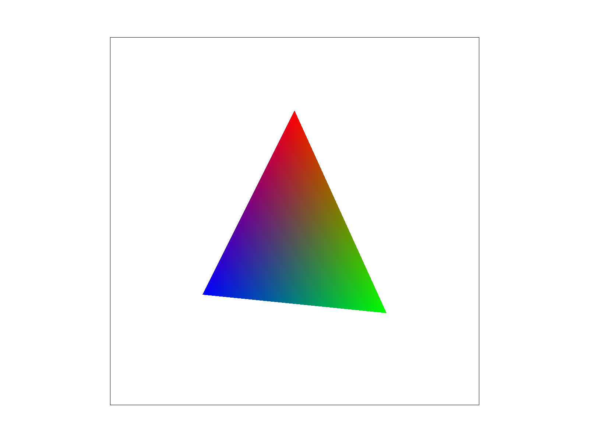

*The Color Wheel:*
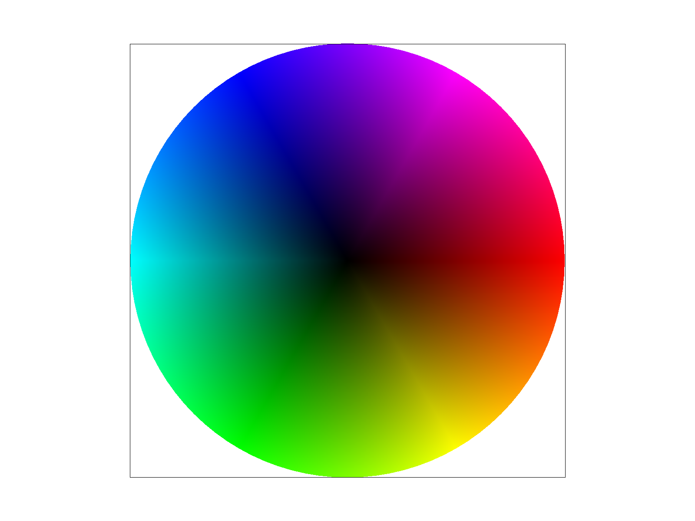
 

## "Pixel Sampling" for Texture Mapping

Pixel sampling is a process in graphics that involves selecting specific pixels from a texture map to apply to a model's surface during rendering. For this task, we will discuss two sampling methods, nearest and bilinear, and texture mapping for rasterizing textured triangles.

In the `RasterizerImp::rasterize_textured_triangle` function, we coded it so that pixel sampling is used to find the color of each pixel within the triangle we are given as a parameter. We determine the smallest/largest x and y out of all x and y values and check if those x and y values are within the triangle using the inside function. If they are, we obtain barycentric coordinates and get a uv 2D vector. Since we want the level to be 0, we will just pass in the uv 2D vector and 0 in the sample_nearest and sample_bilinear functions, depending on psm.

In `Texture::sample_nearest`, we made it so that it selects the color of the nearest texel to the texture coordinate. This approach is simpler and quicker but may lead to a pixelated appearance, such as things that have sharp angles. For the implementation, we calculate the nearest texel by rounding the texture coordinates to the nearest integers and get the texel using the get_texels function.

For bilinear sampling, it is more complex than nearest sampling as we interpolate between the four closest texels to the texture coordinates. Unlike nearest, this approach is smoother and less pixelated. In the `Texture::sample_bilinear` function, we first found 4 points using x and y, similar to sample_nearest, and these 4 points (u0, u1, v0, v1) are going to be used like the points of squares. After this, we interpolate the horizontal and vertical points with proper ratios, which results in a blend of the colors of the 4 points. This bilinear approach is better than nearest when preserving the details of the texture.

Issues: I encountered some confusion regarding when to use `sample_nearest` and `sample_bilinear`. However, it turned out that the decision depends solely on whether `psm` is set to `P_LINEAR` or `P_NEAREST`. I also had difficulty calculating the ratio and understanding which ratio affects which vector value. After reviewing the lecture slides, I realized that the area is considered to be 1, so the difference between each v0 to v1 is only 1.

*Campanile, Sample Rate 1, Nearest Neighbor*
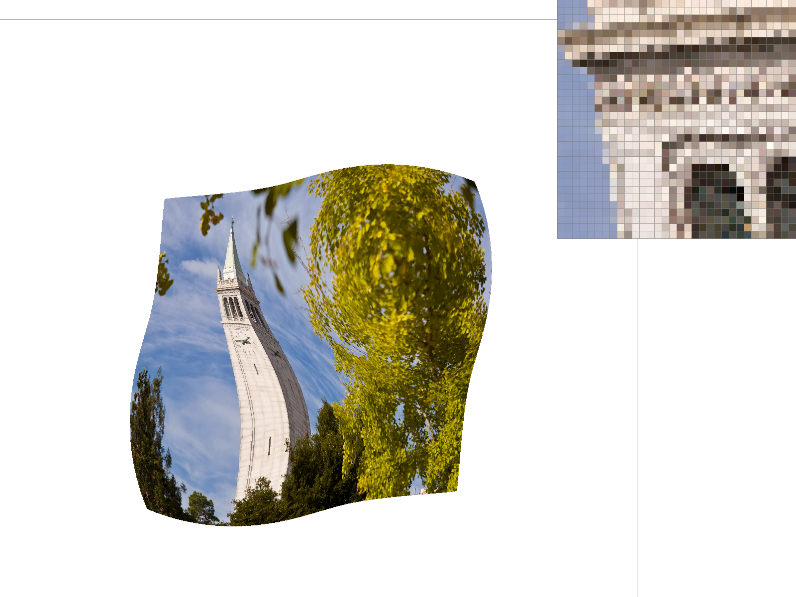
*Campanile, Sample Rate 1, Bilinear*
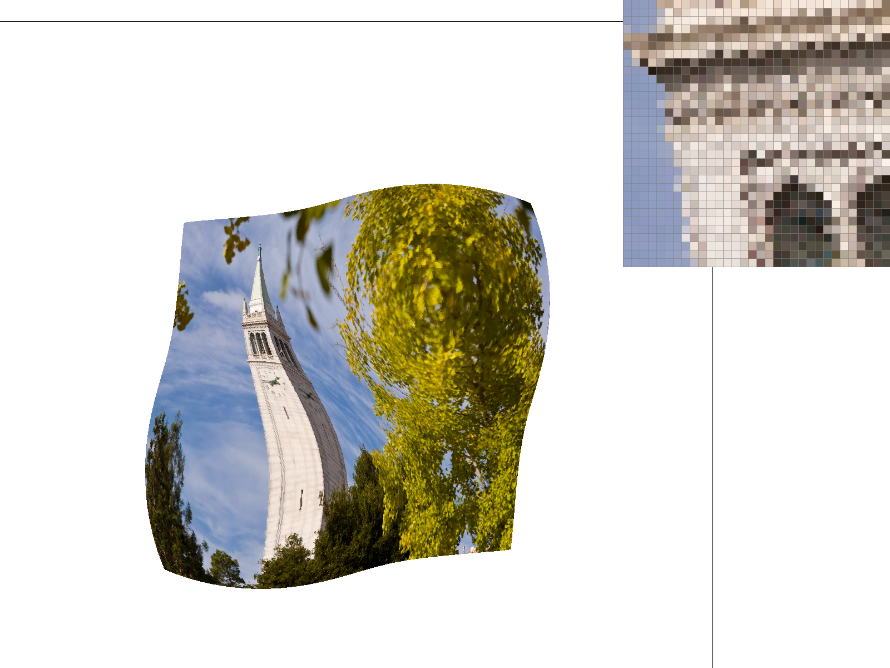
*Campanile, Sample Rate 16, Nearest Neighbor*
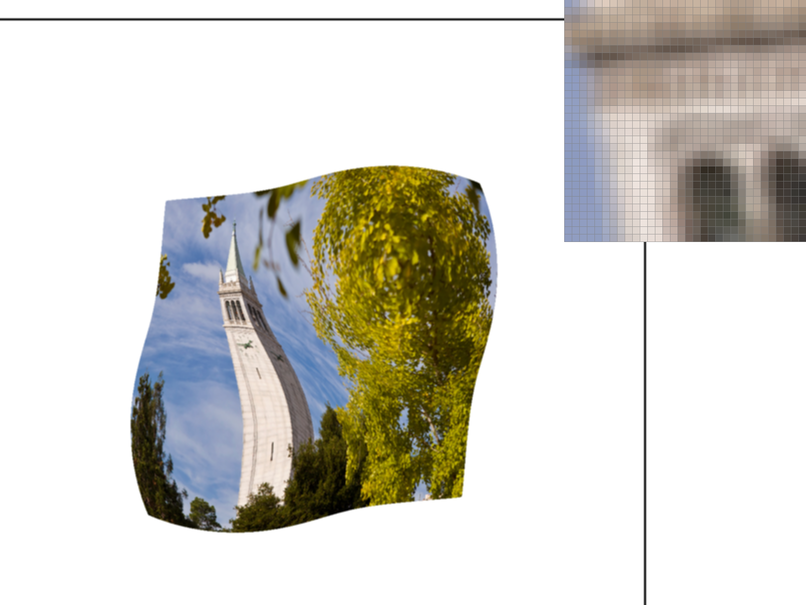
*Campanile, Sample Rate 16, Bilinear*
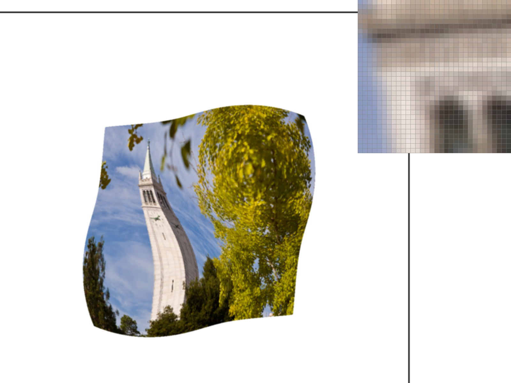
Here, we can observe that bilinear sampling clearly produces smoother transitions and reduces blockiness. In the zoomed-in area, we can see that the nearest sampling arc is more blocky, whereas bilinear sampling results in a smoother arc. For 16 sample rates, we can observe the black shadow line on the tower. Nearest sampling shows a more pixelated line, whereas bilinear sampling presents a much smoother line. If you look closely at the sharp angles, bilinear sampling provides a much clearer and more accurate representation of textures.

 

## "Level Sampling" with Mipmaps for Texture Mapping

Level sampling is a technique used to improve texture mapping by obtaining the proper level of details for a texture.

In the `RasterizerImp::rasterize_textured_triangle` function, I added a `SampleParams` variable so that I can pass it into other helper functions. It contains `psm`, `lsm`, and `p_uv, p_dx_uv, p_dy_uv`. To get the coordinates, we had to interpolate using barycentric coordinates for `(x,y), (x+1,y), and (x,y+1)`.

For the `Texture::sample` function, we had to get the right level and color based on the value of `lsm` and `psm`; there are 3 in `lsm` and 2 in `psm`, so we had to find all the total of 6 combinations of it. For `lsm == L_ZERO`, we do not need to do anything other than just return nearest or bilinear depending on `psm` because we know that the level is going to be zero. For `lsm == L_NEAREST`, we had to get the level based on `SampleParam, sp`, and round it. The reason why we rounded is because we wanted to get the nearest level possible from the coordinates. Lastly, for `lsm == L_LINEAR`, we needed to find the low and high level to calculate the blend color in between. In the case of `P_NEAREST`, we would use `sample_nearest` to find the color and return it, whereas for `P_LINEAR`, we used `sample_bilinear` to find what the value of the low and high-level color is and return the proper blend of it.

In the `Texture::get_level` function, we looked at the slide and saw the equation that we need to use to find the level. We needed to find `L` based on the coordinates and find the maximum of the square root of two duv/dx and duv/dy. Then, take log base 2 to find `D` and return it. In addition to that, we noticed that sometimes, the level can go beyond or under `mipmap.size()`, therefore, we would return 0 if it is less than 0 or mipmap size if it is greater than mipmap.

Speed: `NEAREST` is faster than `LINEAR` because it requires accessing fewer texels. With a more significant number of accesses to texel, it would slow down the rendering. However, we would get a much better visual representation in `LINEAR`.

Memory Usage: With higher levels of detail using `L_NEAREST` or `L_LINEAR`, memory usage would increase because it requires more space for mipmap levels. But with higher levels of detail, we can get a smoother visual representation.

Anti-aliasing Power: With trilinear filtering, it provided powerful aliasing by smoothing out the transition of texels and reducing artifacts. However, on the downside, it requires more memory usage due to accessing different levels of texels.

 

*Brock Purdy, Level Zero, Pixel Nearest*

*Brock Purdy, Level Zero, Pixel Bilinear*
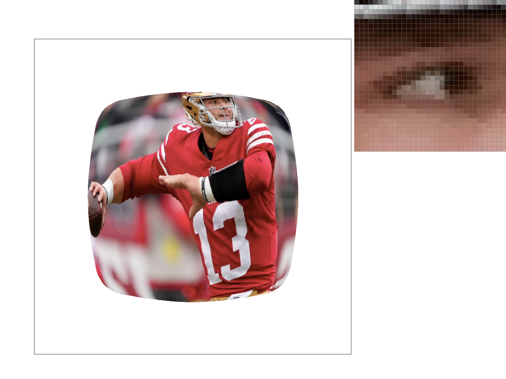
*Brock Purdy, Level Nearest, Pixel Nearest*

*Brock Purdy, Level Nearest, Pixel Bilinear*
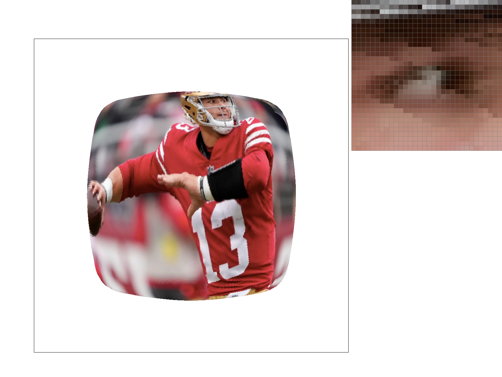
*Brock Purdy, Level Bilinear, Pixel Nearest*
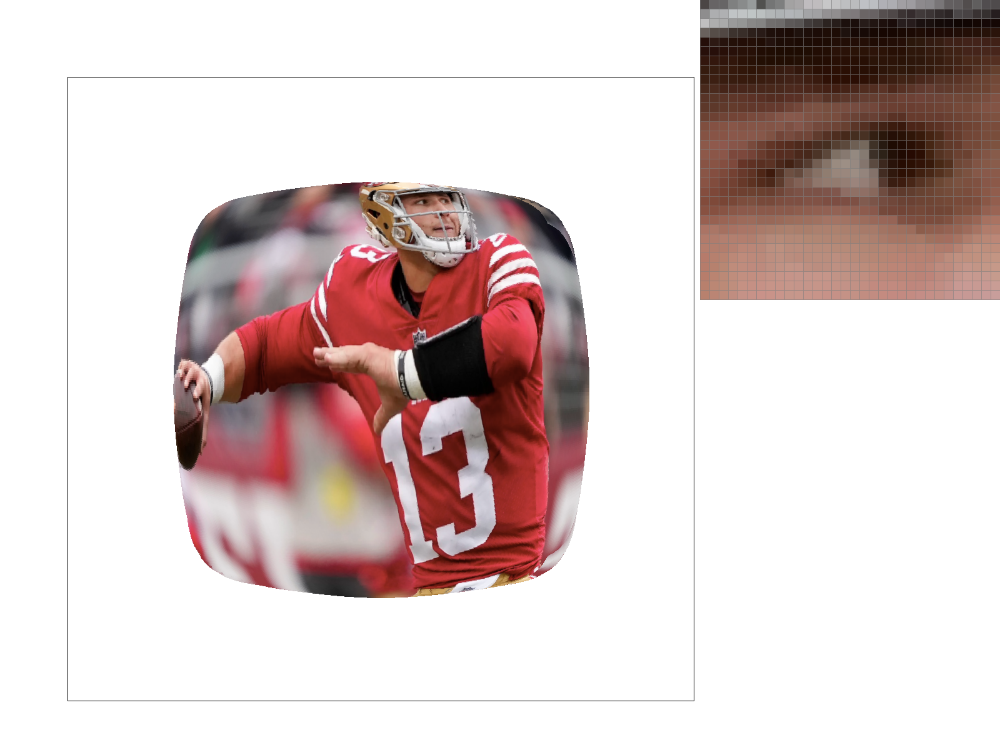
*Brock Purdy, Level Bilinear, Pixel Bilinear*

