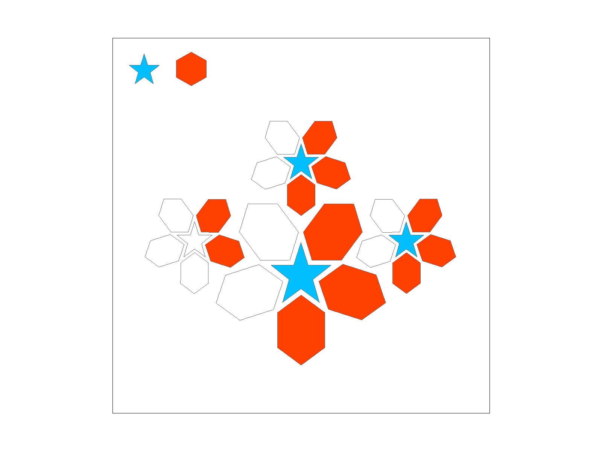
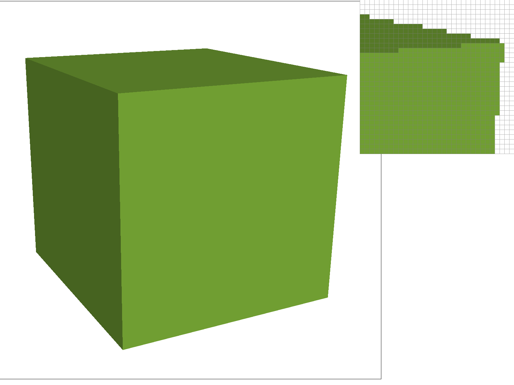
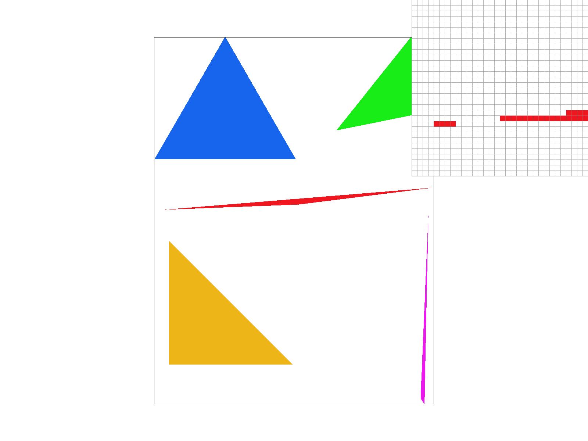

# Homework 1
{:.no_toc}

## Table of contents
{: .no_toc .text-delta }

1. TOC
{:toc}

---

## Task 1: Drawing Single-Color Triangles
To rasterize triangles, we want to sample one point at the center of each pixel and color it based on the given inputs to make our drawings.

For this task, we implemented the `rasterize_triangle()` function in `rasterizer.cpp` using a basic sampling method by taking the middle point of each pixel. At first, we
decided to loop through the entire width and height of the canvas to check if it's in bounds. We originally wanted to make our own function to check if a certain x y coordinate
was in a triangle, but we realized that we could call the `inside()` function that takes care of it for us. This seemed like a simple task. All we had to do was loop through the entire canvas,
sample the svg file at row i + 0.5, column j + 0.5, and fill that pixel with the sampled color.

However, we ran into some problems. The first problem was that there were some white lines generated during our first run. After some debugging, we realized that this was because of
how we made the for loop end at width - 1 and height - 1 when we didn't need to subtract one from both dimensions. It was an error in our thinking because we assumed the +0.5 would
go out of bounds, but the for loop already accounts for it if we use less than instead of less than or equals to. Additionally, we also had some images where only half sof each shape was rendered
correctly. This was because we forgot to account for the right hand rule, and all we had to do was add in another inside check in our if statement. Finally, we fixed the speed by making sure we loop in the right place.
We were originally looping through the entire screen, but we noticed that it's faster to loop around the bounding box of the triangle. We do this by taking the min of all x points, min of all y points,
max of all x points, and max of all y points to get our corresponding box dimensions. This sped up the process and made our images generate much faster than before.

*The Original Failure (No Right Hand Rule):*

*After Adding in the Right Hand Rule:*

*The Cube's Edges Using Basic Sampling:*

*The test4.svg File Working:*

## Task 2: Antialiasing by Supersampling

PLACEHOLDER

## Task 3: Transforms

PLACEHOLDER

## Task 4: Barycentric coordinates

PLACEHOLDER

## Task 5: "Pixel sampling" for texture mapping

key is clarity and succinctness
1. approach to the problem
2. implementation of each part
3. problems encountered and how it was solved

	- RasterizerImp::rasterize_textured_triangle
	approach: Explain pixel sampling in your own words and describe how you implemented
	it to perform texture mapping. Briefly discuss the two different pixel sampling methods, nearest and bilinear.
	Similar to previous tasks, we noticed that we have to After found coodrinates we noticed that we have to pass that value to
	sample_nearest and sample_bilinear

	implementation: We get smallest/largest x and y out of all x and y and see if those x and y are in the triangle using inside function and
	if it is we get barycentric coordinates and get uv 2D vector. Because we want the level to be 0, we will just pass in uv 2D vector
	and 0 in sample_nearest and sample_bilinear fucntion depends on psm.

	Issues: I encountered when to use sample_nearst and sample_bilinear but turns out we just needed to see whether if psm is P_LINEAR or P_NEAREST.

	- Texture::sample_nearest
	approach: I noticed that there are two parameter and one of the hint was using get_texel function. our initial approach was
	first to get tx and ty and using get_texel, get the color.

	implementation: using uv, we get x and y by multiplying uv.x*(width - 1) and uv.y*(height - 1). Because uv coordinates
	are normalized, we need to subtract one from width and height when multiplying it.

	Issues: None

	- Texture::sample_bilinear
	dinates for x,y,z and apply on u and v variables. Als and since we knew
	what
Check out the svg files in the svg/texmap/ directory. Use the pixel inspector
to find a good example of where bilinear sampling clearly defeats nearest sampling.
Show and compare four png screenshots using nearest sampling at 1 sample per pixel,
nearest sampling at 16 samples per pixel, bilinear sampling at 1 sample per pixel,
and bilinear sampling at 16 samples per pixel.

Comment on the relative differences. Discuss when there will be a large
difference between the two methods and why.

		Task 5:

## Task 6: "Level sampling" with mipmaps for texture mapping

PLACEHOLDER
