# Homework 3
{:.no_toc}

## Table of contents
{: .no_toc .text-delta }

1. TOC
{:toc}

---

# Part 1: Ray Generation and Scene Intersection
## Task 1: Generating Camera Rays

PLACEHOLDER

## Task 2: Generating Pixel Samples

PLACEHOLDER

## Task 3: Ray-Triangle Intersection

PLACEHOLDER

## Task 4: Ray-Sphere Intersection

PLACEHOLDER

# Part 2: Bounding Volume Hierarchy
## Task 0: Timing Experiment

PLACEHOLDER

## Task 1: Constructing the BVH

PLACEHOLDER

## Task 2: Intersecting the Bounding Box

PLACEHOLDER

## Task 3: Intersecting the BVH

PLACEHOLDER

## Part 3: Direct Illumination

In our `estimate_direct_lighting_hemisphere`, we have a number of samples and we want to iterate by that amount. Using `w_out` that was provided and `w_i` and `pdf` that we created, we pass that into the `sample_f` function to get the Lambertian BSDF value. Then, using the Monte Carlo Estimator, we calculate the light for the next ray and interact using the `bvh->intersect` function, summing all the light and dividing by the number of samples.

For `estimate_direct_lighting_importance`, it's similar to the previous function, which is hemisphere, but with a bit of difference. We account for the number of lights in the scene and sample using the `sample_L` function that's in `scene->light`. Based on this, we have an inner for loop that iterates `ns_area_light` times. In the inner loop, we create a next ray that intersects, and using variables we got from `sample_L`, we calculate the amount and sum them up. Additionally, we also want to check if the light is a delta light, and if so, we want to stop the for loop. After the inner loop, we divide the sum of the light amount by the number of iterations and add to the total light sum.

We also have `zero_bounce_radiance` that simply returns `isect.bsdf->get_emission()`.

Both of these function is called by one_bounce_radiance. Depends on the value of `direct_hemisphere` that was defined in the command line. Also, before calling this one_bounce radiance, we want to make sure that we call render the the light source by calling `zero_bounce_radiance` as well.

*Hemisphere*
 
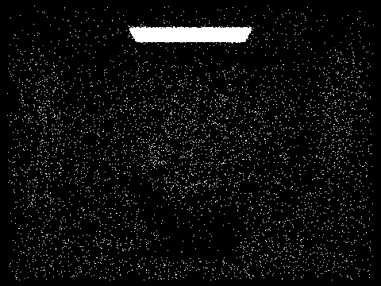
 
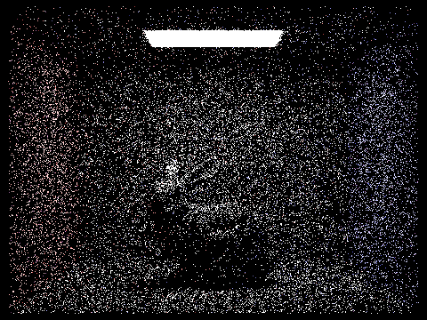
 
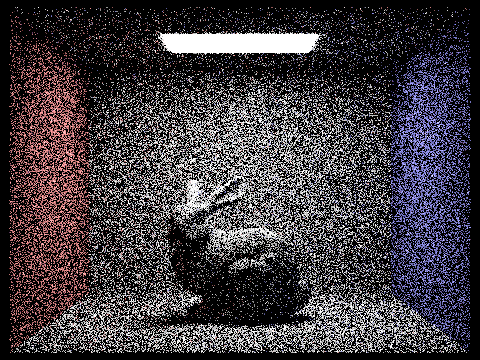
 
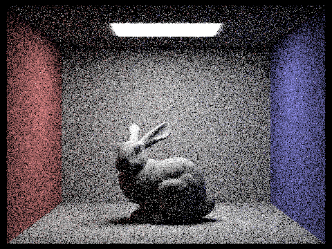

 

*Importance*
 
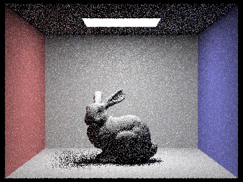
 

 
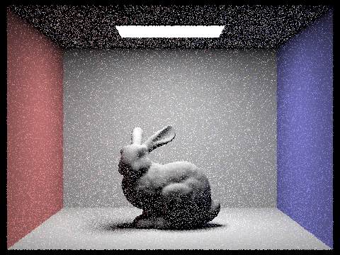
 

 

### Compare analysis
*Hemisphere*
 
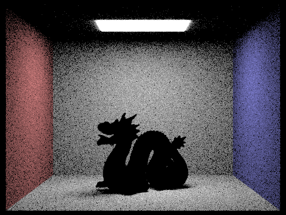
 
*Importance*
 

 

Looking at these two pictures, we noticed that importance sampling is less noisy and has better quality of shadows. This is because the light sources on surfaces are more precisely simulated. On the other hand, for our Hemisphere sampling, we noticed that the lighting is more uniform and has higher noise in shadow.

## Part 4: Global Illumination

In our `at_least_one_bounce_radiance`, we first check to see if `isAccumBounces` is false. If it is, we consider rendering the indirect lighting based only on `m`. Otherwise, we add `one_bounce_radiance` to `L_out` and proceed. For our Russian Roulette, we use 0.4 as recommended in the specification, and by using `coin_flip`, we determine whether to continue executing the code. If the function returns true, we call `sample_f` using `isect` obtained from the function parameter and pass in `wi`. Then, we check if it intersects with our newly created ray with the current depth minus one. If it does, we calculate `L_out` by calling `at_least_one_bounce_radiance` again, thereby recursively calculating one bounce at a time. In the case of `isAccumBounces` being false, we set `L_out` to equal the latest indirect light calculation.

As seen in the images, when `isAccumBounces` is set to false, we only capture indirect light. For example, at `-m 1`, we only see light that has bounced once, meaning we should not see the light source, which we don't. In contrast, when `isAccumBounces` is true, we can see the light source as well as walls/bunny that have been illuminated, because these include one-bounce lights.

For a high number of bounces, such as 100, we should not see a difference beyond the 10th bounce because, at 100 bounces, the radiance becomes so minimal or nonexistent that further bouncing is effectively inconsequential.

*CBbunnies with mth-bounce with isAccumBounces True and 2048 samples*
 
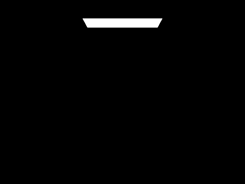
 

 
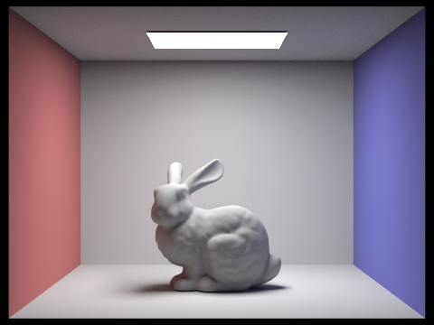
 
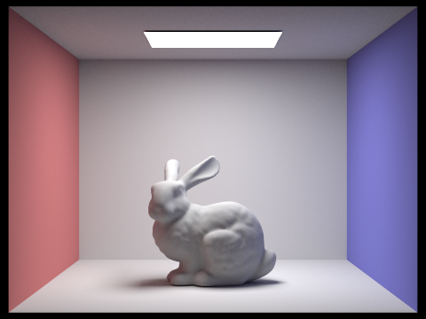
 

 

 

*CBbunnies with mth-bounce with isAccumBounces False and 2048 samples*
 

 
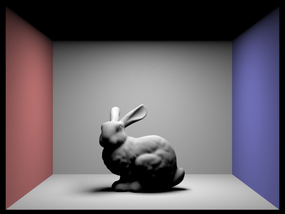
 
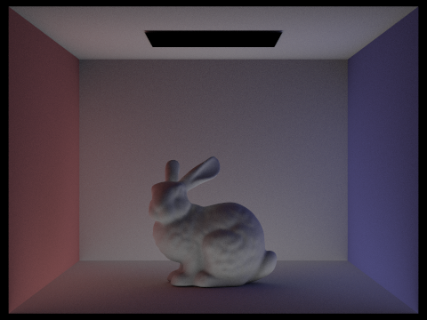
 
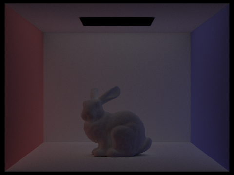
 
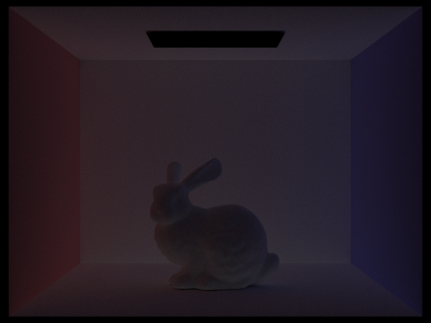
 
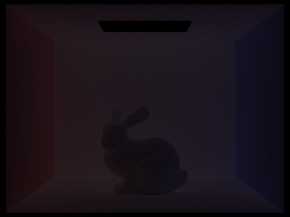

 

*Russian Roulette*
 
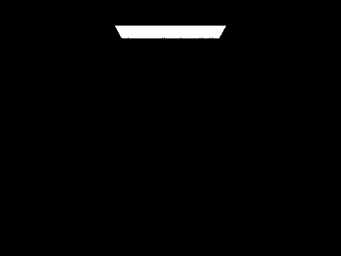
 
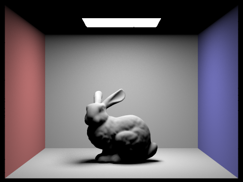
 

 
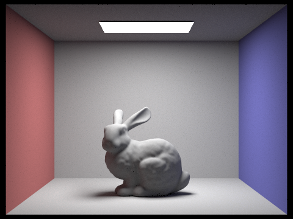
 

 

 

# Part 5: Adaptive Sampling

PLACEHOLDER
