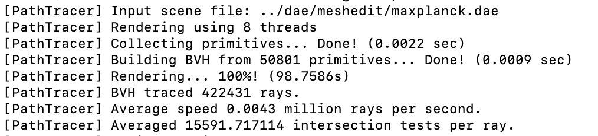

# Homework 3
{:.no_toc}

## Table of contents
{: .no_toc .text-delta }

1. TOC
{:toc}

---
## Overview
This is our third homework that focuses on rendering 3D models and lights. We work with and render many different scenes including bunnies or spheres in a room.

# Part 1: Ray Generation and Scene Intersection
## Task 1: Generating Camera Rays

To simulate a camera, we have to create a function that can generate rays. In computer graphics, rays are used to take a "snapshot" of the current angle of where the camera is looking. You start with the eye point that looks through an image plane, and the rays that are sent out are later
used to check for intersections. When an intersection is detected, you can tell the camera that there is an object there and determine what it looks like depending on its lighting.

For this specific task, we are given normalized coordinates and must return a new Ray object. This input is in camera space, but we will be converting it to world space. First, we calculate the bottom left and upper right corners of the 2D image plane. This can be derived from the coordinates
`-tan(radians(this->hFov)/2.0f), -tan(radians(this->vFov)/2.0f), -1)` and `tan(radians(this->hFov)/2.0f), tan(radians(this->vFov)/2.0f), -1` for the bottom left and upper right corners respectively. Afterwards, to get the direction, we multiply the camera to world rotation matrix to interpolate
and get the exact intersection point on the plane. Finally, we normalize this direction, set the near and far clipping planes by changing `min_t` and `max_t`, and return the final Ray object we just created.

 

*A Diagram of how Ray Generation Works*

## Task 2: Generating Pixel Samples

Next, we have to sample pixels. Since the ray that we generated in the previous part is only one ray and does not calculate all the rays in a pixel, we have to integrate by estimating using the average of `ns_aa` samples. In other words, we are generating multiple rays inside a specific pixel and
returning the average. 

To do this, we have to loop `ns_aa` times. We take a sample by generating a ray using specific offset and sample coordinates, take the radiance by calling `est_radiance_global_illumination()`, and averaging everything at the end. Once we finish, we can update both the pixel and the sample buffer
at the specific coordinate that was inputted.

 

*A Diagram of Pixel Sample Generation*

*Debugging Camera Ray Depth (CBEmpty)*

*Debugging Camera Ray Depth (Banana)*

## Task 3: Ray-Triangle Intersection

Now that we have ray generation complete, we have to detect intersections between rays and triangles. When we are looking for intersections in `Triangle::has_intersection` and `Triangle::intersect`, we also want to return the nearest intersection point as well. Originally, we planned on using normal 2D plane intersection detection. The way to do this would be to
use the ray equation `r(t) = o + td`. When you solve for `t`, you also check to see if `t` is a positive integer. If it is, that means that there was an intersection. After finding `t`, you need to restrict it for further calculations.

However, we decided to use the Moller-Trumbore algorithm since it had a clearer set of steps and was easier for us to debug. Additionally, we had a lecture slide that we could easily reference. The main difference between the algorithms is that the Moller-Trumbore algorithm uses a lot of dot products and
multiplication in order to check for triangle intersections, and it is more efficient compared to the plane intersection check.

When the function was completely implemented, we were able to generate scenes correctly like the example with the empty room by setting the variables in our Intersection object `isect`.

 

*A Rendered Empty Room*

*A Rendered Coil*

## Task 4: Ray-Sphere Intersection

Finally, we had to implement the intersection function between rays and spheres. The functions `Sphere::has_intersection()` and `Sphere::intersect()` have similar concepts compared to those of the triangles. When you intersect, it's no longer just a plane but rather a circle that we're comparing against. We use the quadratic equation to solve for the possible intersections, since
there can be either 0, 1, or 2 intersections when a ray passes a circle. This was the main difference, and we had to implement this in `Sphere::test()`, which would be called in the other two functions. Like the triangle functions, we also have to restrict the `t` values and also set the `isect` values when we detect a ray intersection.

 

*A Rendered Room with Spheres*

# Part 2: Bounding Volume Hierarchy
## Task 1: Constructing the BVH

Rendering a lot of these scenes that have many triangles will take very long, so we had to switch to a faster algorithm. By switching to a BVH (Bounding Volume Hierarchy) algorithm, we can reduce the runtime from O(N) to O(log N). To do this, we had to first construct the BVH tree. To construct a tree, we had to think about how we wanted to implement a base case. As seen from the instructions, we want to
keep splitting boundaries until the number of objects in our boundary is less than or equal to `max_leaf_size`. Next, we had to figure out when to recursively call and what heuristic to use.

The main heuristic we used to determine where to split was to take the spatial median. What this means is that we would look for the axis with the greatest extent and try to partition it in a way that splits as evenly as possible. To do this, we determined the axis with the highest spread (either X, Y, Z). Afterwards, we sort the primitives based on their centroid's positions. This
makes it very easy to know where to split since you can determine the "middle" of all the primitives. Finally, we partition from the median by calling `construct_bvh` recursively on one side (from `start` to `middle`) and recursively on the other (`middle` to `end`). After assigning these recursive calls to variables called `leftNode` and `rightNode`, we set the node's variables such as `l`
and `r` to be those nodes, and also set `node->bb` to be the bounding box we set earlier. We decided to go with the spatial median heuristic since it was relatively simple and was also easier to debug.

 

*Cow (Root)*

*Cow (Root->Right)*

*Cow (Root->Right->Right)*

## Task 2: Intersecting the Bounding Box

The next part that we had to implement was the function `BBox::intersect`. For each axis, we had to do a series of steps. First, we had to check to see if the axis on `r.d` was equal to 0. If it is, that means it's parallel. We also check to see if that same axis for `r.o` is between the limits. If it isn't, we don't have to continue further; we can just return false.
Next, we can solve for `tmin` and `tmax` of the axis. We set the highest of `t0` and `tmin` as `t0` and the lowest of `t1` and `tmax` as `t1`. If `t0` is greater than `t1`, we return false since there was no intersection.

We repeat these for all the axes, so we need to keep restricting the bounds for x, y, and z. All these steps were derived from the lecture slide given to us in class.

 

*Lecture Slide on Bounding Boxes*

## Task 3: Intersecting the BVH

Finally, we have to implement intersection detection for BVHs. We followed a pretty similar algorithm to `construct_bvh`, where the only difference is that we are using traversal. When a ray is cast, it either hits the left bounding box or the right bounding box. We keep recursively calling this function to explore the region that the ray is located in until we reach the
smallest box possible that has `max_leaf_size` or fewer primitives. When we reach this bounding box, we iterate through all primitives located in this targeted bounding box and start checking to see if there were any intersections with the actual primitives instead of just the box. We return true if there was an intersection with one of these primitives, and false if none were
hit. For `has_intersection`, we just have to check if any have an intersection, but for `intersect`, we had to keep track of the number of intersections and find the nearest one as well.

Here are some of our renders with the new O(log N) BVH implementation.

 

*Lucy*

*Beast*

*Max Planck*

*Peter*

## Speed Analysis

We see a very noticeable difference when rendering with and without the BVH implementation. The default implementation loops through triangles one by one, which will be very slow if you reach thousands of primitives. As seen from the screenshots, rendering the `maxplanck.dae` with the naive implementation takes around 99 seconds to complete. On the other hand, the BVH implementation
only takes 0.05 seconds to complete. This is because a O(log N) implementation is much faster than an O(N), even if you scale N to be very high.

 

*Rendering Speed* ***Without*** *BVH*

*Rendering Speed* ***With*** *BVH*

# Part 3: Direct Illumination
## Tasks 1-4

In our `estimate_direct_lighting_hemisphere`, we have a number of samples and we want to iterate by that amount. Using `w_out` that was provided and `w_i` and `pdf` that we created, we pass that into the `sample_f` function to get the Lambertian BSDF value. Then, using the Monte Carlo Estimator, we calculate the light for the next ray and interact using the `bvh->intersect` function, summing all the light and dividing by the number of samples.

For `estimate_direct_lighting_importance`, it's similar to the previous function, which is hemisphere, but with a bit of difference. We account for the number of lights in the scene and sample using the `sample_L` function that's in `scene->light`. Based on this, we have an inner for loop that iterates `ns_area_light` times. In the inner loop, we create a next ray that intersects, and using variables we got from `sample_L`, we calculate the amount and sum them up. Additionally, we also want to check if the light is a delta light, and if so, we want to stop the for loop. After the inner loop, we divide the sum of the light amount by the number of iterations and add to the total light sum.

We also have `zero_bounce_radiance` that simply returns `isect.bsdf->get_emission()`.

Both of these function is called by one_bounce_radiance. Depends on the value of `direct_hemisphere` that was defined in the command line. Also, before calling this one_bounce radiance, we want to make sure that we call render the the light source by calling `zero_bounce_radiance` as well.

 

**Hemisphere 1 sample per pixel**
 
*CBbunny with light 1*
 

 
*CBbunny with light 4*
 

 
*CBbunny with light 16*
 

 
*CBbunny with light 64*
 

 

**Importance 1 sample per pixel**
 
*CBbunny light 1 without H*
 

 
*CBbunny light 4 without H*
 

 
*CBbunny light 16 without H*
 

 
*CBbunny light 64 without H*
 

 

## Comparison Analysis
**Hemisphere**
 

 
**Importance**
 

 

Looking at these two pictures, we noticed that importance sampling is less noisy and has better quality of shadows. This is because the light sources on surfaces are more precisely simulated. On the other hand, for our Hemisphere sampling, we noticed that the lighting is more uniform and has higher noise in shadow.

# Part 4: Global Illumination
## Tasks 1-3

In our `at_least_one_bounce_radiance`, we first check to see if `isAccumBounces` is false. If it is, we consider rendering the indirect lighting based only on `m`. Otherwise, we add `one_bounce_radiance` to `L_out` and proceed. For our Russian Roulette, we use 0.4 as recommended in the specification, and by using `coin_flip`, we determine whether to continue executing the code. If the function returns true, we call `sample_f` using `isect` obtained from the function parameter and pass in `wi`. Then, we check if it intersects with our newly created ray with the current depth minus one. If it does, we calculate `L_out` by calling `at_least_one_bounce_radiance` again, thereby recursively calculating one bounce at a time. In the case of `isAccumBounces` being false, we set `L_out` to equal the latest indirect light calculation.

As seen in the images, when `isAccumBounces` is set to false, we only capture indirect light. For example, at `-m 1`, we only see light that has bounced once, meaning we should not see the light source, which we don't. In contrast, when `isAccumBounces` is true, we can see the light source as well as walls/bunny that have been illuminated, because these include one-bounce lights.

For a high number of bounces, such as 100, we should not see a difference beyond the 10th bounce because, at 100 bounces, the radiance becomes so minimal or nonexistent that further bouncing is effectively inconsequential.

 

**CBbunnies with mth-bounce with isAccumBounces True and 2048 samples**
 
*Part 4 Bunny -m 0*
 

 
*Part 4 Bunny -m 1*
 

 
*Part 4 Bunny -m 2*
 

 
*Part 4 Bunny -m 3*
 

 
*Part 4 Bunny -m 4*
 

 
*Part 4 Bunny -m 5*
 

 

**CBbunnies with mth-bounce with isAccumBounces False and 2048 samples**
 
*Part 4 Bunny -o 0 -m 0*
 

 
*Part 4 Bunny -o 0 -m 1*
 

 
*Part 4 Bunny -o 0 -m 2*
 

 
*Part 4 Bunny -o 0 -m 3*
 

 
*Part 4 Bunny -o 0 -m 4*
 

 
*Part 4 Bunny -o 0 -m 5*
 

 

**Russian Roulette**
 
*Part 4 Bunny Russian Roulette -m 0*
 

 
*Part 4 Bunny Russian Roulette -m 1*
 

 
*Part 4 Bunny Russian Roulette -m 2*
 

 
*Part 4 Bunny Russian Roulette -m 3*
 

 
*Part 4 Bunny Russian Roulette -m 4*
 

 
*Part 4 Bunny Russian Roulette -m 100*
 

# Part 5: Adaptive Sampling
## Implementation

Since the Monte Carlo path tracing generates a lot of noise, we can use adaptive sampling to solve this problem. Instead of needing to increase the number of samples to a very high number to reduce the noise, we can actually use adaptive sampling to help us focus on the important parts of the scene.

To do this, we can take the sum of all illuminations by calling `radiance.illum()` in a while loop and assign it to `s1`, do the same but squared for `s2`, and calculate for I. Knowing that I is `1.96 * sigma/mu` to get a confidence level of 0.95, we can plug in the equations `mu = s1/n` and `sigma^2 = (1 / n - 1) * (s2 - (s1)^2 / n)`.
Given these variables, we can get I by setting it as `I = 1.96 * sqrt(sigma2 / n);`. We keep going until either n reaches `ns_aa` or until I is less than `max_tolerance * mu`, and at the end we set the `sampleCountBuffer` correctly to get the rate image.

 

*Rate Image of the Bunny*
 

 
*Rendered Image of the Bunny*
 

 
*Rate Image of the Spheres*
 

 
*Rendered Image of the Spheres*
 

