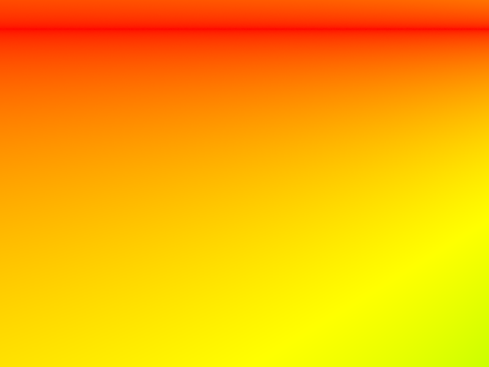

# Homework 3
{:.no_toc}

## Table of contents
{: .no_toc .text-delta }

1. TOC
{:toc}

---
## Overview
This is our third homework that focuses on rendering 3D models and lights. We work with and render many different scenes including bunnies or spheres in a room.

# Part 1: Ray Generation and Scene Intersection
## Task 1: Generating Camera Rays

To simulate a camera, we have to create a function that can generate rays. In computer graphics, rays are used to take a "snapshot" of the current angle of where the camera is looking. You start with the eye point that looks through an image plane, and the rays that are sent out are later
used to check for intersections. When an intersection is detected, you can tell the camera that there is an object there and determine what it looks like depending on its lighting.

For this specific task, we are given normalized coordinates and must return a new Ray object. This input is in camera space, but we will be converting it to world space. First, we calculate the bottom left and upper right corners of the 2D image plane. This can be derived from the coordinates
`-tan(radians(this->hFov)/2.0f), -tan(radians(this->vFov)/2.0f), -1)` and `tan(radians(this->hFov)/2.0f), tan(radians(this->vFov)/2.0f), -1` for the bottom left and upper right corners respectively. Afterwards, to get the direction, we multiply the camera to world rotation matrix to interpolate
and get the exact intersection point on the plane. Finally, we normalize this direction, set the near and far clipping planes by changing `min_t` and `max_t`, and return the final Ray object we just created.

 

*A Diagram of how Ray Generation Works*

## Task 2: Generating Pixel Samples

Next, we have to sample pixels. Since the ray that we generated in the previous part is only one ray and does not calculate all the rays in a pixel, we have to integrate by estimating using the average of `ns_aa` samples. In other words, we are generating multiple rays inside a specific pixel and
returning the average. 

To do this, we have to loop `ns_aa` times. We take a sample by generating a ray using specific offset and sample coordinates, take the radiance by calling `est_radiance_global_illumination()`, and averaging everything at the end. Once we finish, we can update both the pixel and the sample buffer
at the specific coordinate that was inputted.

 

*A Diagram of Pixel Sample Generation*

*Debugging Camera Ray Depth (CBEmpty)*

*Debugging Camera Ray Depth (Banana)*

## Task 3: Ray-Triangle Intersection

Now that we have ray generation complete, we have to detect intersections between rays and triangles. When we are looking for intersections in `Triangle::has_intersection` and `Triangle::intersect`, we also want to return the nearest intersection point as well. Originally, we planned on using normal 2D plane intersection detection. The way to do this would be to
use the ray equation `r(t) = o + td`. When you solve for `t`, you also check to see if `t` is a positive integer. If it is, that means that there was an intersection. After finding `t`, you need to restrict it for further calculations.

However, we decided to use the Moller-Trumbore algorithm since it had a clearer set of steps and was easier for us to debug. Additionally, we had a lecture slide that we could easily reference. The main difference between the algorithms is that the Moller-Trumbore algorithm uses a lot of dot products and
multiplication in order to check for triangle intersections, and it is more efficient compared to the plane intersection check.

When the function was completely implemented, we were able to generate scenes correctly like the example with the empty room by setting the variables in our Intersection object `isect`.

 

*A Rendered Empty Room*

*A Rendered Coil*

## Task 4: Ray-Sphere Intersection

Finally, we had to implement the intersection function between rays and spheres. The functions `Sphere::has_intersection()` and `Sphere::intersect()` have similar concepts compared to those of the triangles. When you intersect, it's no longer just a plane but rather a circle that we're comparing against. We use the quadratic equation to solve for the possible intersections, since
there can be either 0, 1, or 2 intersections when a ray passes a circle. This was the main difference, and we had to implement this in `Sphere::test()`, which would be called in the other two functions. Like the triangle functions, we also have to restrict the `t` values and also set the `isect` values when we detect a ray intersection.

 

*A Rendered Room with Spheres*

# Part 2: Bounding Volume Hierarchy
## Task 0: Timing Experiment

PLACEHOLDER

## Task 1: Constructing the BVH

PLACEHOLDER

## Task 2: Intersecting the Bounding Box

PLACEHOLDER

## Task 3: Intersecting the BVH

PLACEHOLDER

# Part 3: Direct Illumination
## Task 1: Diffuse BSDF

PLACEHOLDER

## Task 2: Zero-bounce Illumination

PLACEHOLDER

## Task 3: Direct Lighting with Uniform Hemisphere Sampling

PLACEHOLDER

## Task 4: Direct Lighting by Importance Sampling Lights

PLACEHOLDER

# Part 4: Global Illumination
## Task 1: Sampling with Diffuse BSDF

PLACEHOLDER

## Task 2: Global Illumination with up to N Bounces of Light

PLACEHOLDER

## Task 3: Global Illumination with Russian Roulette

PLACEHOLDER

## Task 4: Direct Lighting by Importance Sampling Lights

PLACEHOLDER

# Part 5: Adaptive Sampling

PLACEHOLDER
