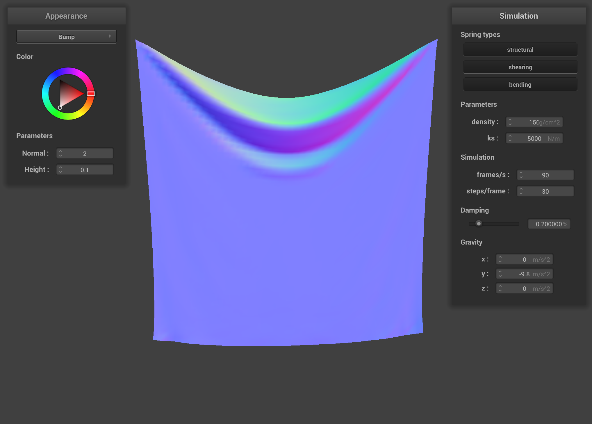
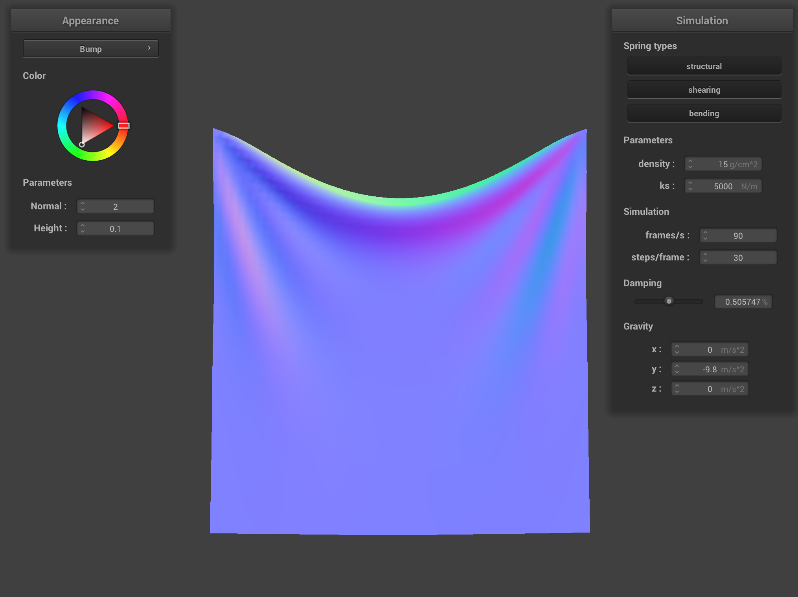
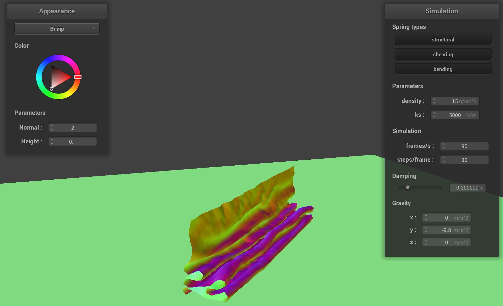

# Cloth Simulator and Shader
{:.no_toc}

## Table of contents
{: .no_toc .text-delta }

1. TOC
{:toc}

---
## Overview
The project focuses on simulating physics, specifically with the way different cloths react to other objects or gravity.

## Part 1: Masses and Springs

In our `buildGrid` function, we have two nested for-loops that build the point masses. We iterate over `num_height_points` * `num_width_points`, setting the position of each point based on its indices. For instance, in the case of a `HORIZONTAL` orientation, we set the x and z positions, and y is set to 1. Otherwise, we set x, y, and make z a random value within a specific range. We also check if the point is pinned; if it is, we initialize it by setting `is_pinned` to true.

Afterward, we connect the points with springs based on their types: Structural, Shearing, and Bending. Structural springs connect points to their left and above, creating the cloth's basic structure. Shearing springs connect diagonally to oppose shearing forces, and Bending springs are used for enhancing the stiffness of the points by skipping one point in either the horizontal or vertical direction to simulate bending resistance.

 

*Images of springs*

*Screenshot of where the mass/spring structure is visible*

*Structural and bending*

*Shearing*

## Part 2: Simulation via Numerical Integration

In the `simulate` function, we implement a simulation step that updates the position of the cloth's point masses based on external acceleration (such as gravity). The first thing we did was calculate the mass and time step based on width, height, density from `ClothParameters`, and `delta_t`. Then we compute the total external forces. Then we compute the spring forces exerted based on current length, `ks`, and rest length. Then, using Verlet integration, we need to update the position if a point is not pinned. This allows the point to move based on damping as well. Lastly, we apply a constraint on spring length change to prevent it from stretching or compressing too quickly.

### Spring Constant, ks
Here we are going to test for different `ks` values to see how does it make the cloth look different. As we increase the spring constant `ks`, we can observe that the cloth becomes more stiff, and with lower `ks` we can see that it is more stretched out.

 

*From ks = 50000 to ks = 50*

*ks = 50000*

*ks = 5000*

*ks = 500*

*ks = 50*

### Density
Unlike spring constant, density is an attribute for point masses. As we increase the density, the effect is opposite of ks. As we increase, we see that the cloth is more stretched, and with lower density, we see a stiff cloth. And this is because of the force exerted on the point proportional to its mass.

 

*From density = 1500 to density = 1.5*

*density = 1500*

*density = 150*

*density = 15*

*density = 1.5*

### Damping
Damping is an interesting factor. It affects how quickly the cloth comes to rest after being played with. With lower damping, we observe that the cloth will not stop moving for a long period of time, whereas with higher damping, we noticed that the cloth comes to rest much more quickly.

 

*From damping = 1 to damping = 0*

*damping = 1*

*damping = 0.5*

*damping = 0.2*

*damping = 0.0*

### Default state of pinned 2 and pinned 4

## Part 3: Handling Collisions with Other Objects

To make the cloth interact with another object, we needed to exploit the vector definition of cloth that touches a sphere and plane. In both `Plane::collide` and `Sphere::collide` functions, we are calculating based on the current vector and the point that is touching either plane or sphere. Then we calculate using `normal` and find the tangent vector and apply the new vector.

Here are images of different `ks` values for cloth falling on a sphere. And we can observe that with higher `ks` the stiffer and more resistant to deformation, and with lower `ks` we can observe that the points of cloth are closer to the sphere and look more relaxing. This is happening because with higher `ks` it is holding the points together, makes less bendy, and lower `ks` that is less force in holding together.

 

*Images of ks falling on sphere ks = 50000 to ks = 500*

*ks = 50000*

*ks = 5000*

*ks = 500*

## Part 4: Handling Self-Collisions

In order to perform self-collisions, we first need to build a spatial map which is done in `build_spatial_map`. Here we iterate through `point_masses` and push back the point to the corresponding hash value. and by hash value we also implement a function called `hash_position` that allows us to have a unique value for each position. Then we implemented a function called `self_collide` where we get the point and see if that point is in the `map` and if it is we change its position appropriately.

 

*Images of self-colliding cloth falling on plane*

Density affects how the cloth moves under gravity. With higher density, cloth has more mass which makes it fall faster and fewer spaces when folded. On the other hand, with lower density, it is lighter which means it should have more fluttery behavior and more spaces when folded.

 

### Varying Density

*Images with different densities 150 to 1.5*

*density = 150*

*density = 15*

*density = 1.5*

Spring constant (ks) determines the stiffness of the cloth. With higher `ks` the cloth should be more resistant to bending and folding which makes less folds. With lower `ks` it allows more flexibility and complexity in how the cloth falls and settles.

 

### Varying ks

*Images with different ks 50000 to 500*

*ks = 50000*

*ks = 5000*

*ks = 500*

## Part 5: Cloth Sim

In this task, we will use custom GLSL shaders that we write to simulate the way different cloths reflect light, shadows, and colors. This will be a continuation similar to Task 3, but this focuses more on the look of the cloth rather than the way it falls.

A shader program is a type of computer program that is designed to use the GPU instead of the CPU. The CPU has been used in our earlier projects for ray tracing different scenes, but it is way too slow to render moving objects. To process these quickly changing scenes that have physics involved, we have to switch to the GPU and use custom shaders to help us. These shaders allow the material of the cloth to look different in real time, and they can be tweaked to change the lighting and textures of different cloths. The shaders we have programmed include Diffuse, Blinn-Phong, Texture, Displacement, Bump, and Mirror shaders.

Each shader program needs a `.vert` and a `.frag` file, which correspond to the vertex and fragment shaders respectively. Vertex shaders first work with all the vertices in the 3D space and converts the points into 2D coordinates. Some of the properties involved include modifications to the normals. On the other hand, we have fragment shaders. These types of shaders typically deal with the lighting, coloring, and texturing of the object. With both of these types of shaders, you can create a very realistic feel to the different cloth types involved. Both of these process each vertex and make a set of calculations, using the texture's lookup material and other properties like the color.
It then outputs the processed calculations with new lighting, thus creating a working shader program.

### Blinn-Phong Shading Model Explanation

We can see how this works with the Blinn-Phong example. The Blinn-Phong model is a way to quickly simulate the way light reacts to different objects using 3 basic components. The first component is the ambient lighting (`ka * Ia`) that represents a constant and basic illumination throughout all objects. The next component is the diffuse reflection (`kd * (I / r ^ 2) * max(0, n * l)`), which is dependent on the angle of the light and gives the material a more detailed look. The final component involved is the specular reflection (`ks * (I / r ^ 2) * max(0, n * h) ^ p`), which gives a mirror-like effect to the object. BY combining all these, you can get a very realistic feel
when utilizing this shader in your scene. To code this, we modified the `Phong.frag` file and used different `vec3` constants to adjust the equation. Piecing together all the components including the user input, we were able to successfully create a Blinn-Phong shader program.

### Blinn-Phong Images

*Ambient by itself*

*Diffuse by itself*

*Specular by itself*

*The Complete Blinn-Phong With All 3*

### Texture Mapping Images

*Berkeley 1*

*Berkeley 2*

*Berkeley 3*

*Sherlock 1*

*Sherlock 2*

*Sherlock 3*

### Bump and Displacement Comparison and Images
Bump and Displacement shaders are similar in that they both use a texture and use the base code from Blinn-Phong shading. However, bump is smoother and displacement is more coarse depending on the texture. In our case, we are using a brick texture, so if you look at the two images, you notice that bump is noticeablely smoother whereas displacement has coarse edges that make each brick protrude. The reason behind this is the changes
we made in `Displacement.vert`, where we had to use the equation `p' = p + n * h(u, v) * kh`. 

We can also compare the differences between the input of 16 and the input of 128. If we look at the one with 16, we notice that there are larger protruding areas, but they are very jagged and not detailed. On the other hand, if you scale it up to 128, you notice that the brick outline becomes much clearer and even the small dots inside each individual brick get generated.

*Bump Sphere*

*Bump Cloth*

*Displacement Sphere (Default)*

*Displacement Cloth (Default)*

*Displacement Sphere (-o 16 -a 16)*

*Displacement Sphere (-o 128 -a 128)*

### Mirror Images

*Mirror Sphere*

*Mirror Cloth*

